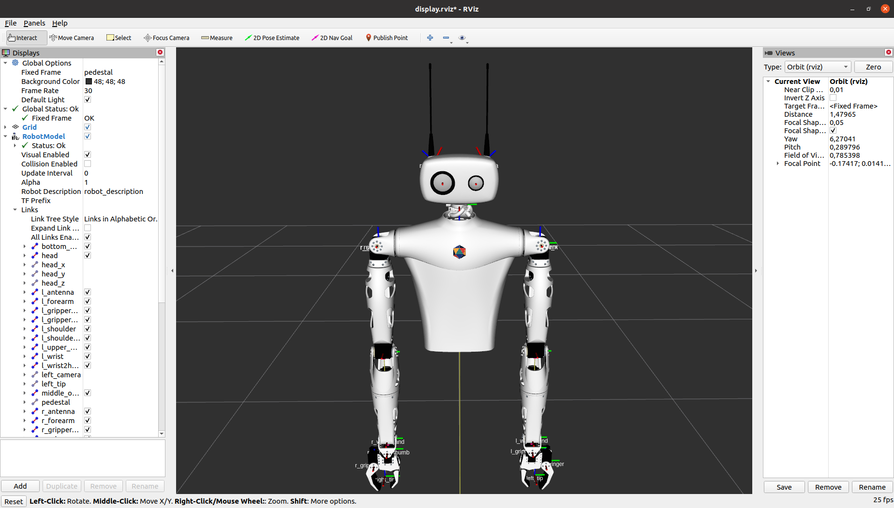

# Reachy description

This ROS package contains URDF and collada files to use the [Reachy](https://pollen-robotics.com) robot with ROS1 Noetic.



## Quickstart

Launch the following command in order to run RViz, visualize the robot and move the joints:
```bash
roslaunch reachy_description display.launch gui:=True
```

If you are not using the Advanced Reachy configuration, you may disable parts of the robot, e.g. for the Basic configuration:
```bash
roslaunch reachy_description display.launch gui:=True left_arm:=false head:=false
```

## Get the URDF of Reachy
### Option 1. Generate the URDF by choosing your effector (preferred)

Invoke xacro by passing the desired effector as an argument and redirect the output to an URDF file:
```bash
roscd reachy_description

# For the Advanced configuration:
xacro reachy.URDF.xacro >reachy.URDF

# For the Expressive configuration:
xacro reachy.URDF.xacro left_arm:=false >reachy.URDF

# For the Basic configuration:
xacro reachy.URDF.xacro left_arm:=false head:=false >reachy.URDF
```

**Note:** If you're using higher level package such as `reachy_moveit_config`, the configuration is propagated to xacro. Thus there is no need to execute xacro by hand if you do not intend to work directly with the URDF.

### Option 2. Use a static URDF (will not be customized to your config)

If you do not want to execute xacro by yourselves, you may use the static file [reachy.URDF](./reachy.URDF) which is the output of xacro generated fo the Advanced configuration (full body: head + left arm + right arm).

## Roadmap/CFC
* [ ] Center joints at the center of motor axes
  * Avoid manual editing: will invalidate inertias
  * Display tf frames and clean up overlaps
* [ ] Correct right/left arm symmetry
